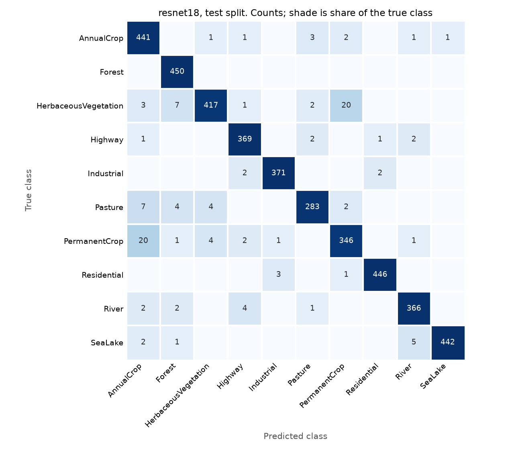

# Satellite Land Use Classifier (EuroSAT)

[](https://github.com/austi20/eurosat-landuse-classifier/actions/workflows/tests.yml)

Land use classification on Sentinel-2 satellite imagery: 27,000 labeled 64x64 image
patches across 10 land use classes, in PyTorch. A small CNN trained from scratch is
compared against an ImageNet pretrained ResNet18 fine tuned on the same split, so the
gap between them measures what transfer learning actually bought.

Satellite imagery is also used as alternative data in finance, where funds estimate
economic activity from overhead views of parking lots, storage tanks and construction
sites. That use starts with the step this project covers: given a patch of ground, name
what is on it, and say where that goes wrong.

**What I found:** the fine tuned ResNet18 reaches **97.06% test accuracy** (95% CI
96.54% to 97.58%, 4,050 test images), against an 11.11% majority class baseline and
89.06% validation accuracy for the small CNN. The model was chosen on validation before
test was scored. The test split has been scored twice, not once, for reasons explained
[below](#the-test-split-has-been-scored-twice).

## Questions

1. How much does an ImageNet pretrained ResNet18 beat a CNN trained from scratch on
   64x64 RGB patches, and how much does either beat guessing the majority class?
2. Which land use classes get confused with each other, and is the confusion a real
   visual ambiguity at 64x64 resolution or a modeling failure?
3. How close does a short fine tune on a CPU get to the 98.57% overall accuracy
   reported in the EuroSAT paper, and where does the gap come from?

## Results

| Model | Val accuracy | Test accuracy |
|---|---|---|
| Majority class (AnnualCrop) | 11.11% | 11.11% |
| Small CNN from scratch | 89.06% | not scored |
| **ResNet18, ImageNet pretrained, fine tuned** | **97.43%** | **97.06%** |
| *EuroSAT paper: ResNet-50, RGB, 80/20 split* | | *98.57%* |

The small CNN has no test number on purpose. Only the model chosen on validation gets
scored on test, and the ResNet won validation by eight points.

**Majority class baseline: 11.11%.** Recorded before any model was trained. Six classes
tie for largest, with 2,100 training images each, so "the majority class" is really a
six way tie. The code takes the first one, AnnualCrop. Any of the six gives the same
11.11%, because the stratified split puts exactly 450 of each into val and into test.

**Small CNN from scratch: 89.06% on validation.** Three conv blocks (32, 64, 128
channels, each conv, batch norm, ReLU, max pool), global average pooling, dropout 0.3 and
a linear layer. 94,986 parameters. Adam at 1e-3, batch 128, random horizontal and
vertical flips, 15 epochs. Three timed runs on a desktop CPU (8 core AMD Ryzen 7 9800X3D,
no GPU) took 3.8, 3.9 and 4.9 minutes. The first run, on a laptop CPU (Intel i5-1230U),
took 3.8. Seeded, and every run on both machines reproduced every epoch's val accuracy
exactly. Inputs are normalized
with channel means and standard deviations from the train split only.

It is the best of 15 epochs, picked on the same val split it is reported on, so it leans
optimistic; the last epoch scored 88.22%. Val accuracy also swung by up to six points
between late epochs (87.19%, 85.14%, 89.06%, 82.67%, 88.22%), so small gaps on this
split mean little. The gap to the ResNet is not small.

**Fine tuned ResNet18: 97.43% on validation.** ImageNet weights, the 1000-way head
replaced with a fresh 10-way linear layer, and every layer fine tuned rather than
freezing the backbone. Inputs are resized 64 -> 224 with bilinear interpolation and
normalized with ImageNet statistics, because those are what the pretrained filters
expect. Adam at 1e-4, batch 64, the same random flips, 3 epochs. The run took 11.2
minutes on the desktop CPU (Ryzen 7 9800X3D, no GPU), validation passes included. The
same script took 163 minutes on the laptop CPU (i5-1230U), about 14 times longer.

| Epoch | Train accuracy | Val accuracy |
|---|---|---|
| 1 | 93.19% | 96.02% |
| 2 | 97.12% | **97.43%** |
| 3 | 98.01% | 97.41% |

Epoch 2 was kept, ahead of epoch 3 by one validation image out of 4,050. Validation had
flattened by then, so more epochs at a constant learning rate were not obviously going
to help.

**Test: 97.06%.** 3,931 of 4,050 test images correct, 119 wrong. That is 0.37 points
below the validation number. Some of that is likely the optimism from picking the epoch
on validation, but the gap sits inside the test interval, so it is not clearly more than
noise.

### The test split has been scored twice

The ResNet18 was first trained on the laptop. That run reached 97.11% on validation and
**97.09% on test**, and its results were committed before this one. I then reran the
same script, with the same seed, the same pinned torch 2.14.0 and no code changes, on a
desktop to get a faster timing. It did not reproduce the laptop's weights. The most
likely cause is that the two CPUs compute convolutions with different low level kernels,
so the floating point results differ in the last bits, and three epochs of training grow
that into a visibly different model. The small CNN, by contrast, reproduced exactly
across both machines.

I switched the reported model to the desktop run and scored it on test. Nothing about
the model, the data or the hyperparameters changed between the two, and the laptop's
test score is 0.03 points higher than the one reported, so the second look at test did
not buy a better number. It does mean the test split is no longer untouched, and the
laptop run's numbers are still in the git history (commit `c0eb1d9`).

### What transfer learning bought

About eight points of accuracy, from 89.06% to 97.43% on the same validation split, and
most of it in the classes the small CNN was worst at:

| Class | Small CNN val | ResNet18 val | ResNet18 test |
|---|---|---|---|
| River | 72.27% | 97.60% | 97.60% |
| HerbaceousVegetation | 82.44% | 93.33% | 92.67% |
| SeaLake | 84.00% | 98.67% | 98.22% |
| AnnualCrop | 85.56% | 98.89% | 98.00% |
| Highway | 87.73% | 98.40% | 98.40% |
| Industrial | 93.33% | 99.47% | 98.93% |
| PermanentCrop | 94.13% | 94.40% | 92.27% |
| Pasture | 94.67% | 93.00% | 94.33% |
| Residential | 98.00% | 99.11% | 99.11% |
| Forest | 98.89% | 100.00% | 100.00% |

River went from the worst class to a middling one. PermanentCrop barely moved, Pasture
went slightly down on validation, and HerbaceousVegetation gained about eleven points.
Those three are now the three weakest classes on validation, and they are where the
ResNet's remaining errors live.

### Confusion matrix



Rows are the true class, columns the prediction. Shading is the share of the true class,
on a compressed scale so that a 2% error is visible next to a 98% diagonal.

**The errors are agricultural.** 80 of the 119 test errors (67%) are one vegetation
class mistaken for another: AnnualCrop, PermanentCrop, Pasture, HerbaceousVegetation and
Forest. The largest single cells:

| True | Predicted | Count | Share of true class |
|---|---|---|---|
| PermanentCrop | AnnualCrop | 20 | 5.3% |
| HerbaceousVegetation | PermanentCrop | 20 | 4.4% |
| Pasture | AnnualCrop | 7 | 2.3% |
| HerbaceousVegetation | Forest | 7 | 1.6% |
| SeaLake | River | 5 | 1.1% |

The laptop run's matrix had the same five cells at the top, in a slightly different
order. The notes below come from looking at that run's misclassified test patches by
eye, not just the counts:

- **PermanentCrop -> AnnualCrop.** The missed PermanentCrop patches are large rectangular
  parcels with stripes, which is what annual cropland looks like. The PermanentCrop
  patches it gets right tend to be finer grained and mottled, closer to orchards and
  vineyards. At 10 m per pixel, orchard rows and striped fields can look the same.
- **HerbaceousVegetation -> PermanentCrop.** The misses are dry, hilly, speckled
  terrain, a light patchwork of scrub and bare soil that looks like the Mediterranean
  PermanentCrop patches.
- **Pasture -> AnnualCrop.** Correct Pasture patches are mostly uniform green. The
  misses have visible straight field edges, which the model reads as cropland.
- **SeaLake -> River.** Correct SeaLake patches are almost all open water. The misses
  contain an edge: a shoreline, a pier, a harbor, a boat. Something linear inside water
  seems to pull the prediction toward River.

**The two pairs I expected to matter mostly did not.** Before training, the plan named
Highway / River (narrow linear features) and PermanentCrop / HerbaceousVegetation (green
texture) as the likely confusions. What actually happened:

- **Highway / River: 6 errors out of 750 test images of the two classes.** 2 Highway
  patches were called River and 4 River patches Highway. That is River's largest single
  leak, but at this accuracy the pair is nearly solved, and the water confusion that
  does exist is SeaLake -> River.
- **PermanentCrop / HerbaceousVegetation: real, but one way.** 20 HerbaceousVegetation
  patches were called PermanentCrop, and only 4 went the other way. PermanentCrop's own
  biggest leak is into AnnualCrop, not HerbaceousVegetation.

### Against the published 98.57%

This model is 1.51 points below the paper, and the paper's number sits above the top of
this model's 95% interval, so the gap is not test set noise. The comparison is not like
for like, though. The paper's 98.57% is a pretrained **ResNet-50** on RGB with an
**80/20** train/test split (Helber et al., Table III). Here it is a ResNet18 with less
than half the parameters, trained on 70% of the data rather than 80%, for 3 epochs at a
constant learning rate on a CPU. Any of those could explain part of the gap.
This project does not separate them, so which one matters most is untested.

## Data

**EuroSAT**: 27,000 labeled, georeferenced 64x64 patches from the ESA **Sentinel-2**
satellite, in 10 land use classes. MIT licensed. Sentinel-2 data is free and open under
EU law.

- Dataset and citation: https://github.com/phelber/EuroSAT
- Access used here: `torchvision.datasets.EuroSAT(root=..., download=True)`, the RGB
  variant built into torchvision (a 94 MB zip).
  https://docs.pytorch.org/vision/stable/generated/torchvision.datasets.EuroSAT.html
- Paper: Helber, Bischke, Dengel and Borth, "EuroSAT: A Novel Dataset and Deep Learning
  Benchmark for Land Use and Land Cover Classification", IEEE JSTARS 2019.
  https://arxiv.org/abs/1709.00029

The download is not committed. `data/` is gitignored and the dataset is fetched on
first run.

### It is not balanced

EuroSAT is often described as balanced. It is close, but not exactly. The largest
classes have 3,000 images and Pasture has 2,000, a 1.5x spread. Counts as printed by
`src/split.py`:

| Class | Images | Share | Train | Val | Test |
|---|---|---|---|---|---|
| AnnualCrop | 3,000 | 11.11% | 2,100 | 450 | 450 |
| Forest | 3,000 | 11.11% | 2,100 | 450 | 450 |
| HerbaceousVegetation | 3,000 | 11.11% | 2,100 | 450 | 450 |
| Highway | 2,500 | 9.26% | 1,750 | 375 | 375 |
| Industrial | 2,500 | 9.26% | 1,750 | 375 | 375 |
| Pasture | 2,000 | 7.41% | 1,400 | 300 | 300 |
| PermanentCrop | 2,500 | 9.26% | 1,750 | 375 | 375 |
| Residential | 3,000 | 11.11% | 2,100 | 450 | 450 |
| River | 2,500 | 9.26% | 1,750 | 375 | 375 |
| SeaLake | 3,000 | 11.11% | 2,100 | 450 | 450 |
| **Total** | **27,000** | | **18,900** | **4,050** | **4,050** |

The imbalance is mild enough that plain accuracy is still a fair headline, but it is why
the baseline is 11.11% and not 10%.

### The split

Stratified 70/15/15 into train, val and test, seed 42, using two calls to scikit-learn's
`train_test_split`. Every image's split assignment is committed in
[`splits/eurosat_split_seed42.csv`](splits/eurosat_split_seed42.csv), keyed by its path
inside the dataset, so the split can be audited or reused without rerunning anything.

## Method

The evaluation protocol was fixed before any modeling:

1. **Majority class baseline**, written down first.
2. **Stratified 70/15/15 split** with a fixed seed, saved to disk.
3. **Model A:** small CNN from scratch, 3 convolutional blocks.
4. **Model B:** ResNet18 pretrained on ImageNet, head replaced with 10 outputs,
   normalized with ImageNet statistics, input resized 64 -> 224.
5. **Model selection on validation only.** The test split is scored once, at the end,
   with the model already chosen.
6. **Confusion matrix** committed as a figure and read out in this README by class name.

The git history shows the order. The ResNet's validation results and `src/evaluate.py`
were committed before `evaluate.py` was run, and the test results arrived in a later
commit. Step 5 was broken once, when the ResNet was retrained on a second machine and
test was scored again; see [above](#the-test-split-has-been-scored-twice).

## Repo layout

```
src/         data loading, split, baseline, training and evaluation code
splits/      committed split assignments
results/     committed metrics as JSON, test.json holds the one test score
tests/       pytest suite
figures/     committed figures, including the confusion matrix
data/        EuroSAT download (gitignored)
models/      trained weights (gitignored)
```

## Running it

```bash
python -m venv .venv
.venv\Scripts\activate          # Windows; use source .venv/bin/activate elsewhere
pip install -r requirements.txt
```

On Linux, the default PyPI `torch` wheel is the CUDA build and pulls several
gigabytes of NVIDIA runtime packages with it. On Windows the default is already
CPU only. To force CPU wheels on any platform, install torch first from the
PyTorch CPU index:

```bash
pip install torch==2.14.0 torchvision==0.29.0 --index-url https://download.pytorch.org/whl/cpu
pip install -r requirements.txt
```

Then, from the repo root:

```bash
python src/split.py          # downloads EuroSAT, prints class counts, writes the split
python src/baseline.py       # majority class baseline -> results/baseline.json
python src/train_scratch.py  # small CNN, val only -> results/small_cnn.json
python src/train_resnet.py   # ResNet18, val only -> results/resnet18.json (11 min desktop, 2.7 h laptop)
python src/evaluate.py       # picks on val, scores test once -> results/test.json
python -m pytest
```

`train_resnet.py` downloads the ImageNet weights (45 MB) on first run. On a laptop, keep
it awake: training stalls while the machine sleeps.

## Limitations

- **European imagery only.** Every patch is over Europe, so the 97.06% applies to
  European land use and nothing else. Field sizes, crop types, building materials,
  vegetation and water color differ across other continents and climates, and the
  errors here are concentrated in exactly those agricultural classes. Nothing in this
  project supports using the model outside Europe.
- **64x64 is coarse.** A patch is 640 m across at 10 m per pixel. Tree rows and crop
  rows, or a lake shore and a riverbank, are the same few pixels wide, and most of the
  remaining errors are pairs like that.
- **RGB only.** Sentinel-2 carries 13 spectral bands. The torchvision RGB variant throws
  away the near infrared and shortwave infrared bands, which are commonly used to tell
  vegetation types apart. With 67% of the errors between vegetation classes, they are
  worth trying next, but this project did not test them.
- **One seed, one split.** The 95% interval (96.54% to 97.58%) covers test sampling
  only, not the variation from retraining. Even the same seed on a different CPU moved
  validation from 97.11% to 97.43% and test from 97.09% to 97.06%, so small differences
  between runs here are not meaningful. The 3 epoch budget was set by laptop CPU time,
  not tuned.
- **Not like for like with the paper.** The published 98.57% uses a larger network and
  more training data, so the 1.51 point gap is not a clean measure of anything.

## License

MIT. See [LICENSE](LICENSE).
